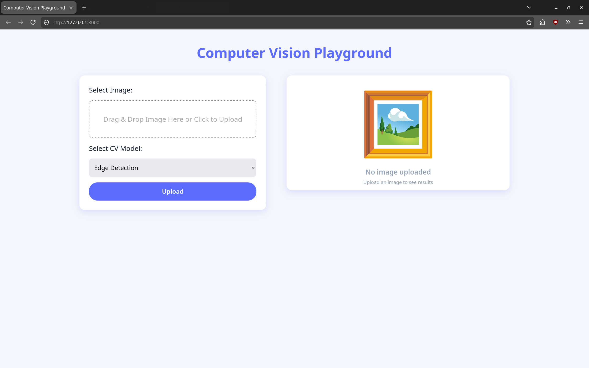
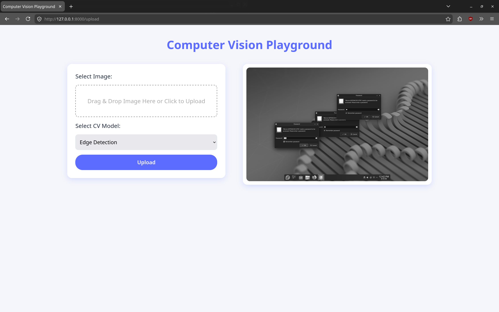
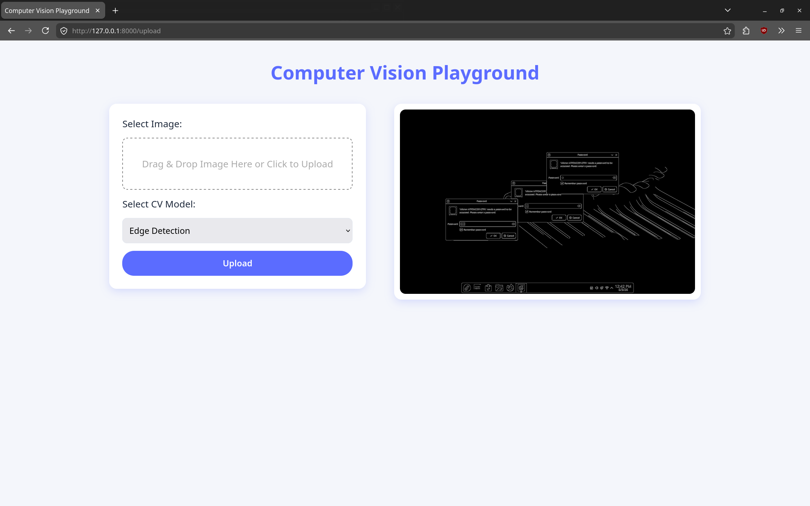
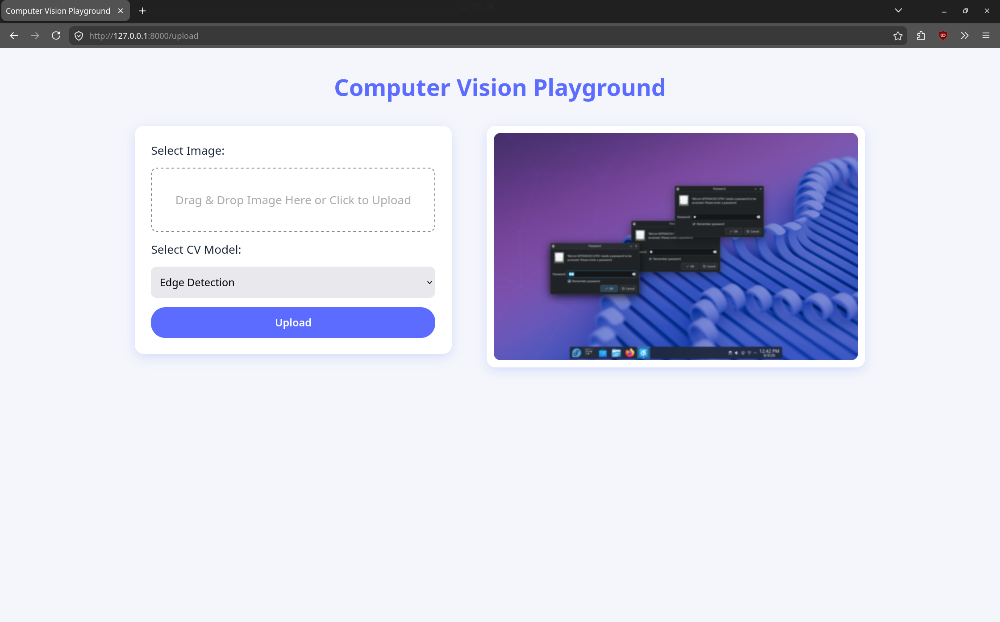

# Computer Vision Playground

A Computer Vision project built using **FastAPI + OpenCV**, showcasing core image processing techniques through an interactive web application.

---

## Overview

This project demonstrates practical implementation of fundamental **computer vision operations** with a clean backend architecture and a simple, user-friendly interface.

Users can upload images and apply transformations.

---

## Key Features

- Image upload via web interface
- Multiple image processing operations:
  - Grayscale conversion
  - Edge detection (using Canny algorithm)
  - Gaussian blur

- Fast and asynchronous backend using FastAPI
- Processed image preview
- Modular backend design (separate processing modules)

---

## Tech Stack

- **Backend:** FastAPI (Python)
- **Frontend:** HTML, CSS
- **Libraries:**
  - OpenCV
  - shutil
  - os
    _refer requirements.txt for more_

---

## System Architecture

```text
User (Browser)
      ↓
Frontend (HTML/CSS Form)
      ↓
FastAPI Backend (main.py)
      ↓
Image Processing Modules
(grayscale / gaussian / edge)
      ↓
Processed Image Output
```

---

## Screenshots

### Upload Interface



### Grayscale Output



### Edge Detection Output



### Gaussian Blur Output



---

## Project Structure

```bash
computer-vision-playground/
│
├── backend/
│   ├── grayscale.py
│   ├── gaussian.py
│   ├── edge.py
│
├── frontend/
│   ├── styles.css
│   ├── index.html
│
├── uploads/
├── screenshots/
│
├── main.py
├── requirements.txt
└── README.md
```

---

## Download & Setup

```bash
git clone https://github.com/your-username/computer-vision-playground.git
cd computer-vision-playground

python -m venv venv
venv\Scripts\activate      # Windows
# source venv/bin/activate # Mac/Linux

pip install -r requirements.txt
```

---

## Run the Application

```bash
uvicorn main:app --reload
```

Open:

```
http://127.0.0.1:8000
```

---

## Learning Outcomes

- Built REST APIs using FastAPI
- Integrated frontend with backend processing
- Applied core computer vision techniques using OpenCV
- Handled file uploads and server-side processing
- Structured a modular Python project

---

## Future Enhancements

- Add more filters (thresholding, morphology, sharpening)
- Real-time webcam processing
- Drag-and-drop UI
- Model-based features (face detection, object detection)
